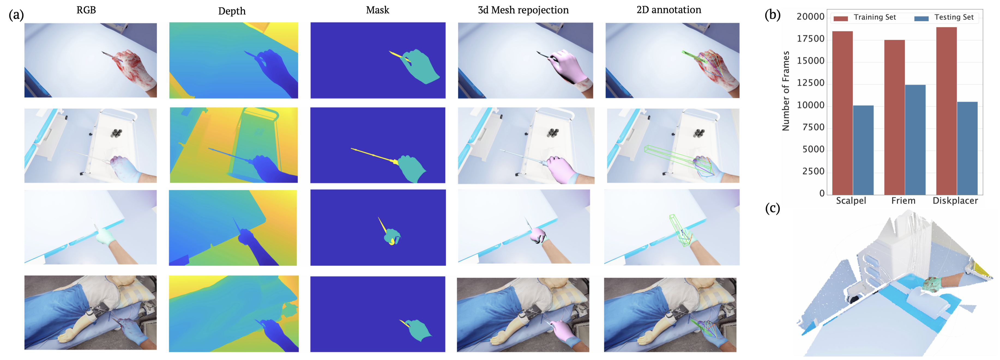
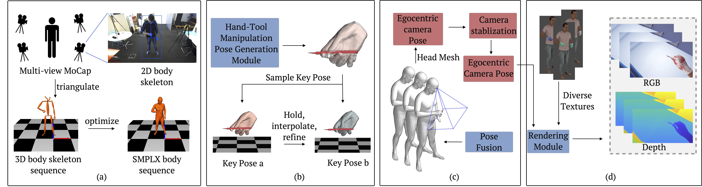
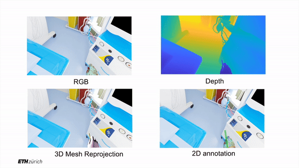
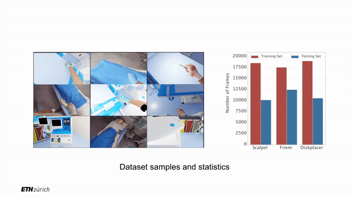

# POV-Surgery
### A Dataset for Egocentric Hand and Tool Pose Estimation During Surgical Activities
26th International Conference on Medical Image Computing and Computer Assisted Intervention;
MICCAI 2023,**<span style="color:red;">(Oral)</span>**

This is the official code release for POV Surgery at MICCAI 2023.

[](https://link.springer.com/chapter/10.1007/978-3-031-43996-4_42)
[](https://batfacewayne.github.io/POV_Surgery_io/)
[](https://drive.google.com/drive/folders/1nSDig2cEHscCPgG10-VcSW3Q1zKge4tP?usp=drive_link)
[](https://arxiv.org/abs/2307.10387)
[](https://colab.research.google.com/drive/1gX2Vg0dBb0xqzl5vIipwOPV5HarlOlYn?usp=sharing)

Check out the POVSurgery YouTube videos below for more details.

| Video Description (with audio) | Overview Video |
| :---: | :---: |
|  [](https://www.youtube.com/watch?v=CfCCzEO_3D8) | [](https://www.youtube.com/watch?v=CaOEwoFHZc0&t=9s) |  
## Components

#### Synthetic data generation pipeline 
- diverse hand tool grasping generation
- hand-tool grasping refinement and interpolation
- body pose and hand sequence fusion
- pre-rendering and groud truth generation scipts
- blender rendering scripts
#### POV-Surgery dataset utilities
- Ground truth reprojection and visualization scripts
#### Fine-tuning demo code
- HandOccNet training and testing code
## Dataset Usage
Please download the dataset POV_Surgery_data.zip at [POV-Surgery](https://drive.google.com/drive/folders/1nSDig2cEHscCPgG10-VcSW3Q1zKge4tP?usp=drive_link), unzip it and put it in a desired location. Please remember that if you wish to download and utilize our dataset, compliance with the licensing conditions is mandatory. Our proposed dataset contains 53 egocentric RGB-D sequences with 88k frames and accurate 2D/3D hand-object pose annotations. Here's a teaser of our dataset:
| RGB-D and Annotation | Dataset Overview |
| :---: | :---: |
|  |  |  


## Project structure
Please register yourself at [SMPL-X](https://smpl-x.is.tue.mpg.de/login.php) and [MANO](https://mano.is.tue.mpg.de/login.php) to use their dependencies. Please read and accept their liscenses to use SMPL-X and MANO models. There are different versions of manopth. We have included the implementation of [mano](https://github.com/otaheri/MANO) in our repo already. Then please download the data.zip from [POV-Surgery](https://drive.google.com/drive/folders/1nSDig2cEHscCPgG10-VcSW3Q1zKge4tP?usp=drive_link), unzip it and put in the POV_Surgery folder. We have prepared all the dependencies required and the final structure should look like this:

```bash
    POV_Surgery
    ├── data
    │    │
    │    ├── sim_room
    │          └── room_sim.obj
    │          └── room_sim.obj.mtl
    │          └── textured_output.jpg
    │    │
    │    └── bodymodel
    │          │
    │          └── smplx_to_smpl.pkl
    │          └── ...
    │          └── mano
    │                └── MANO_RIGHT.pkl
    │          └── body_models
    │                └── smpl
    │                └── smplx
    ├── grasp_generation
    ├── grasp_refinement
    ├── pose_fusion
    ├── pre_rendering
    ├── blender_rendering
    ├── HandOccNet_ft
    └── vis_data

```
## Environment
We recommend create a python 3.8 environment with conda. Install [pytorch](https://pytorch.org) and [torchvision](https://www.google.com/url?sa=t&rct=j&q=&esrc=s&source=web&cd=&ved=2ahUKEwjR4K2m8NmBAxVNSfEDHeMhCNAQFnoECBgQAQ&url=https%3A%2F%2Fpytorch.org%2Fvision%2F&usg=AOvVaw1cAB7MRIgRgtMiD3UKEL-9&opi=89978449) that suits you operation system. For example, if you are using cuda 11.8 version, you could use:

```Shell
pip install torch torchvision --index-url https://download.pytorch.org/whl/cu118
```
Then you should install [pytorch3d](https://github.com/facebookresearch/pytorch3d/tree/main) that suits your python and cuda version. An example could be found here: 

```Shell
pip install --no-index --no-cache-dir pytorch3d -f https://dl.fbaipublicfiles.com/pytorch3d/packaging/wheels/py38_cu113_pyt1110/download.html
```
Then install the dependencies to finish the environment set up following the requiremesnts.sh. 
```Shell
sh requirements.sh
```
You could refer to the colab demo for hint to set the environment.


## Contact Information
If you have questions, feel free to contact:

Rui Wang: [ruiwang46@ethz.ch](ruiwang46@ethz.ch)
## Acknowledgement
- This work is part of a research project that has been financially supported by
Accenture LLP. Siwei Zhang is funded by Microsoft Mixed Reality & AI Zurich
Lab PhD scholarship. The authors would like to thank PD Dr. Michaela Kolbe
for providing the simulation facilities.
- The authors would like to thank David Botta, Dr. Kerrin Weiss, Isabelle Hofmann, Manuel Koch, Marc Wittwer for their participation in data capture and Dr. Julian Wolf, Tobias Stauffer and prof. Dr. Siyu Tang for the enlightening discussions.
## License
Software Copyright License for non-commercial scientific research purposes. Please read carefully the terms and conditions and any accompanying documentation before you download and/or use the MANO model, data and software, (the "Model & Software"), including 3D meshes, blend weights, blend shapes, software, scripts, and animations. By downloading and/or using the Model & Software (including downloading, cloning, installing, and any other use of this github repository), you acknowledge that you have read these terms and conditions, understand them, and agree to be bound by them. If you do not agree with these terms and conditions, you must not download and/or use the Model & Software. Any infringement of the terms of this agreement will automatically terminate your rights under this License.

## Citation
Wang, R., Ktistakis, S., Zhang, S., Meboldt, M., Lohmeyer, Q. (2023). POV-Surgery: A Dataset for Egocentric Hand and Tool Pose Estimation During Surgical Activities. In: Greenspan, H., et al. Medical Image Computing and Computer Assisted Intervention – MICCAI 2023. MICCAI 2023. Lecture Notes in Computer Science, vol 14228. Springer, Cham. https://doi.org/10.1007/978-3-031-43996-4_42

## BibTeX
```
@misc{wang2023povsurgery,
      title={POV-Surgery: A Dataset for Egocentric Hand and Tool Pose Estimation During Surgical Activities}, 
      author={Rui Wang and Sophokles Ktistakis and Siwei Zhang and Mirko Meboldt and Quentin Lohmeyer},
      year={2023},
      eprint={2307.10387},
      archivePrefix={arXiv},
      primaryClass={cs.CV}
}
```