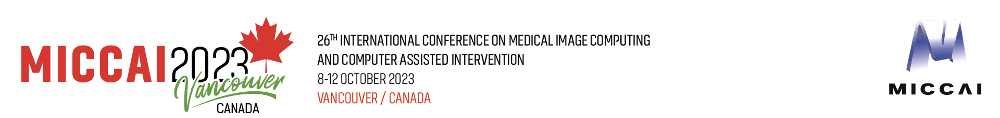

# POV_Surgery
### A Dataset for Egocentric Hand and Tool Pose Estimation During Surgical Activities (MICCAI 2023, Oral)

[](https://arxiv.org/abs/2008.11200)
[](https://arxiv.org/abs/2008.11200)


Check out the YouTube videos below for more details.

| Video Description (with audio) | Overview Video |
| :---: | :---: |
|  [](https://www.youtube.com/watch?v=CfCCzEO_3D8) | [](https://www.youtube.com/watch?v=CaOEwoFHZc0&t=9s) |  
## Coponents

- POV Surgery Dataset visualization and reproject utilities
-  Synthetic data generation pipeline 
- 
  - Diverse Hand Tool grasping generation
  - Hand-Tool grasping refinement and interpolation
  - Human body pose and hand sequence merging
  - pre-rendering and groud truth scipts
  - blender rendering scripts
  - HandOccNet training demo

This is the official code release for POV_Surgery at MICCAI 2023.
## Data
Please prepare the data as follows: MANO/SMPLX 
```bash
    POV_Surgery
    ├── data
    │    │
    │    ├── sim_room
    │          └── room_sim.obj
    │          └── room_sim.obj.mtl
    │          └── textured_output.jpg
    │    │
    │    └── bodymodel
    │          │
    │          └── smplx_to_smpl.pkl
    │          └── ...
    │          └── mano
    │                └── MANO_RIGHT.pkl
    │          └── body_models
    │                └── smpl
    │                └── smplx
    ├── grasp_generation
    ├── grasp_refinement
    ├── pose_fusion
    ├── pre_rendering
    ├── blender_rendering
    ├── HandOccNet_ft
    └── vis_data

```
Basic setup for the project. (Dataset reprojection utilities, etc.)

## Contact Information
If you have questions, feel free to contact:

Rui Wang: [ruiwang46@ethz.ch](ruiwang46@ethz.ch)
## License
Software Copyright License for non-commercial scientific research purposes. Please read carefully the terms and conditions and any accompanying documentation before you download and/or use the MANO model, data and software, (the "Model & Software"), including 3D meshes, blend weights, blend shapes, software, scripts, and animations. By downloading and/or using the Model & Software (including downloading, cloning, installing, and any other use of this github repository), you acknowledge that you have read these terms and conditions, understand them, and agree to be bound by them. If you do not agree with these terms and conditions, you must not download and/or use the Model & Software. Any infringement of the terms of this agreement will automatically terminate your rights under this License.


## BibTeX
```
@misc{wang2023povsurgery,
      title={POV-Surgery: A Dataset for Egocentric Hand and Tool Pose Estimation During Surgical Activities}, 
      author={Rui Wang and Sophokles Ktistakis and Siwei Zhang and Mirko Meboldt and Quentin Lohmeyer},
      year={2023},
      eprint={2307.10387},
      archivePrefix={arXiv},
      primaryClass={cs.CV}
}
```