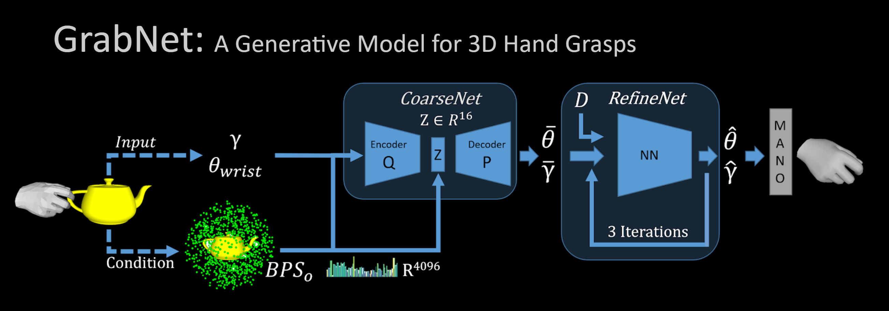

# Grasp Generation module
### The grasp generation module is based on GrabNet


[](https://arxiv.org/abs/2008.11200)



[[Paper Page](https://grab.is.tue.mpg.de)] 
[[Paper](https://arxiv.org/abs/2008.11200) ]

[GrabNet](http://grab.is.tue.mpg.de) is a generative model for 3D hand grasps. Given a 3D object mesh, GrabNet 
can predict several hand grasps for it. GrabNet has two succesive models, CoarseNet (cVAE) and RefineNet.
It is trained on a subset (right hand and object only) of [GRAB](http://grab.is.tue.mpg.de) dataset.
For more details please refer to the [Paper](http://grab.is.tue.mpg.de//uploads/ckeditor/attachments/363/grab_eccv2020.pdf) or the [project website](http://grab.is.tue.mpg.de).


## Getting started
#### CoarseNet and RefineNet models
- Download the GrabNet models from the [GRAB website](https://grab.is.tue.mpg.de), and move the model files to the models folder as described below.
```bash
    GrabNet
        ├── grabnet
        │    │
        │    ├── models
        │    │     └── coarsenet.pt
        │    │     └── refinenet.pt
        │    │     │
```

## Examples
Firstly go to the grasp_generation folder:
  ```Shell
  cd grasp_generation
  ```
- #### Generate grasps for input objects(.ply.,.obj, .stl files etc.)
Change the scale accordingly. For examples, the default scale is 1, which means the input object is in m scale. Change it to 1000 if your input is in mm.

  ```Shell
python ./grabnet/tests/grab_new_tools.py    --obj-path /home/ray/Downloads/disk_recon_handle.ply\
                                                       --rhm-path ../data/bodymodel/mano/MANO_RIGHT.pkl
   ```

- #### Export diverse samples and select desired grasps
change the input accordingly depending the .pt file generated above.
```Shell
python ./grabnet/tests/export_meshes.py 
```
That should generate a folder named "test_meshes" in the 'OUT' directory. The folder contains the generated grasps in .ply format. We suggest using Meshlab to visualize the grasps and to select desired outputs. And note down the id of the desired grasps.
    
- #### Resampling near desired state
change the 'wanted_id' list accordingly. For example, if you want to resample the 1st and 3rd grasp in the test_meshes folder, change the 'wanted_id' to [1,3]. The resampled grasps will be saved in the 'OUT' folder.
 
```Shell
python ./grabnet/tests/subsampling.py   --obj-path /home/ray/Downloads/disk_recon_handle.ply\
        --rhm-path  ../data/bodymodel/mano/MANO_RIGHT.pkl
```

## License
Software Copyright License for **non-commercial scientific research purposes**.
Please read carefully the terms and conditions in the [LICENSE file](https://github.com/otaheri/GRAB/blob/master/LICENSE) and any accompanying documentation
before you download and/or use the GRAB data, model and software, (the "Data & Software"),
including 3D meshes (body and objects), images, videos, textures, software, scripts, and animations.
By downloading and/or using the Data & Software (including downloading,
cloning, installing, and any other use of the corresponding github repository),
you acknowledge that you have read these terms and conditions, understand them,
and agree to be bound by them. If you do not agree with these terms and conditions,
you must not download and/or use the Data & Software. Any infringement of the terms of
this agreement will automatically terminate your rights under this [License](./LICENSE).


