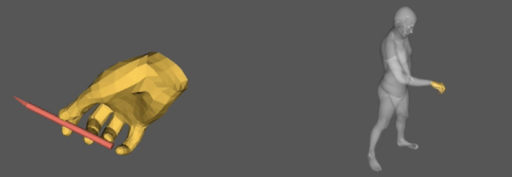

## Data Format and reprojection 
### data structure
- base object R is a random rotation applied to the object to generate more diverse grasping poses; This is set to be fixed one grasping sequence.
- "CamR" and "CamT" are the camera rotation and translation, respectively. 
- "grab2world" is the global transformation from the generated Canonical Hand-Object grasping pose to align with body motion. (From left to right in the image below)

Moreover, You should compete the grasp generation and refienment steps, with keyposes and interpolated poses in 'refined_subsamples' and 'refined_subsamples_interp' folders, respectively.
### Reprojection
We prepare reprojection in pyrender(open3d) and opencv format. You could also refer to the colab demo for more details.
